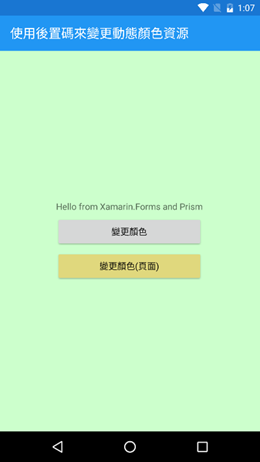
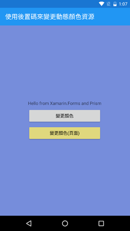
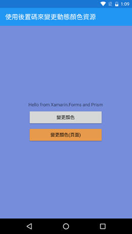

# 如何將 Code Behind 程式碼包裝起來，可以在 ViewModel 內呼叫

在這裡，將會展示如何從原先的 Code Behind 相關處理程式碼，變更或者包裝成為 ViewModel 可以呼叫這些功能。

## XFCodeBehind 專案，使用 Code Behind 來變更顏色資源的顏色

這個專案將會說明，如何使用 Code Behind，當使用按下按鈕之後，使用動態資源的方式，變更 ContentPage 的背景顏色

下圖為該範例程式執行的螢幕截圖

下圖為當按下的 `變更顏色` 按鈕之後，頁面背景顏色會變色的螢幕截圖

下圖為當按下的 `變更顏色(頁面)` 按鈕之後，該按鈕背景顏色會變色的螢幕截圖

## XFDelegate 專案，使用 Delegate，從 ViewModel 內，呼叫 Code Behind 程式碼

在這個專案中，會使用 Data Binding 來綁定按鈕的點擊命令，在 ViewModel 中呼叫 Code Behind 程式碼。

我們要先在頁面 Code Behind 取得這個頁面當時使用的 ViewModel，並且將 ViewModel 的委派方法物件與 Code Behind 內的方法綁定在一起，這樣，我們就可以在 ViewModel 內，執行 Code Behind 的方法。

